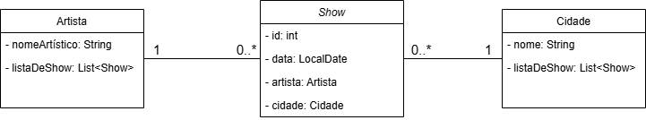

# Projeto da cadeira de Persistência de Objetos(POB)
*  **Curso:** Tecnólogo em Sistemas para Internet(cstsi)
*  **Membros:**
*  *  Erick Felipe
   *  Mikael de Moura
   *  Melquisedeque Vital
*  **Objetivo:** Praticar a criação de classes e a persistência dos objetos na memória usando diferentes tecnologias em cada etapa

---

## Descrição do Modelo de Classes(Sistema de Shows)

*  Sistema que gerencia shows que ocorrem em cidades com seus devidos artistas
*  Cada show só pode ocorrer em uma cidade com um artista
*  Cada artista pode ter vários shows agendados
*  Cada cidade pode ter vários shows agendados

### Diagrama UML

### Consultas Realizadas no Banco de Dados(Persistência de Objeto)

*  quais os shows na data X
*  quais os artistas que vao se apresentar na cidade de nome X
*  quais os artistas que tem mais de N shows na cidade X

---

## Etapas do Projeto
### 1º Etapa: db4o

*  Etapa realizada utilizando db4o para fazer a persistência
*  Realese feito

### 2º Etapa: JPA

*  Etapa em progresso
